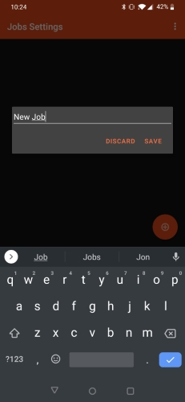
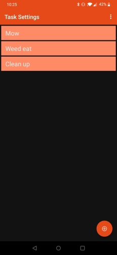
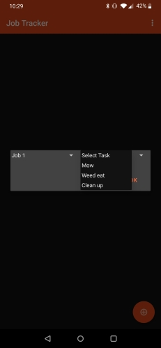
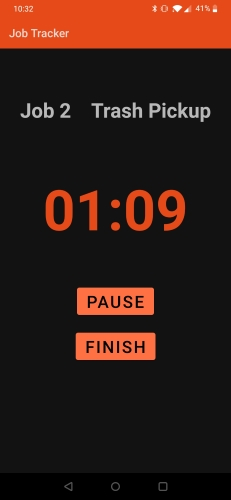
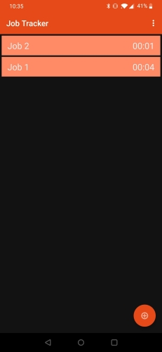
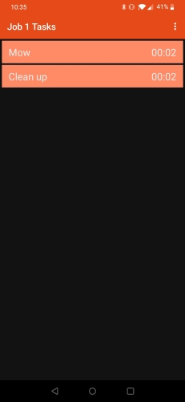

# Description
This is an Android app I designed to keep track of hours worked on different jobs over the summer. It functions as a stopwatch for user defined tasks and keeps a running total of time worked. The design prioritized user functionality and simplistic but quality Android architecture. 

 

## <ins>Features</ins>
* Functionality is broken down into 1) Jobs and 2) Tasks within jobs.
* Users can define custom jobs and associated tasks in the settings menu.
* Users can start a new task from the home screen.
* One task can be active at a time.
* While a task is active the running time is displayed.
* Users can either pause or finish a running task.
* Finished tasks are added to the total job time.
* Task time can be edited or deleted from inside the job menu.
* One Job of a given type can be active at a time.

# Snapshots

  
Video Demonstration: https://youtu.be/2P1zevKgHWw

# Build Instructions
This project was built inside the Android Studio IDE. Clone the repo and import the project into Android Studio to build.

# Possible Improvements
* UX Design. This app was designed with functionality in mind, but little attention was given to the design of the User Interface. A better overall User Interface would enhance this app.

# Known Bugs
* There are no bugs currently being tracked

# Contributions & Licensing
This project is closed to development, however feel free to fork and use any part of the codebase.

